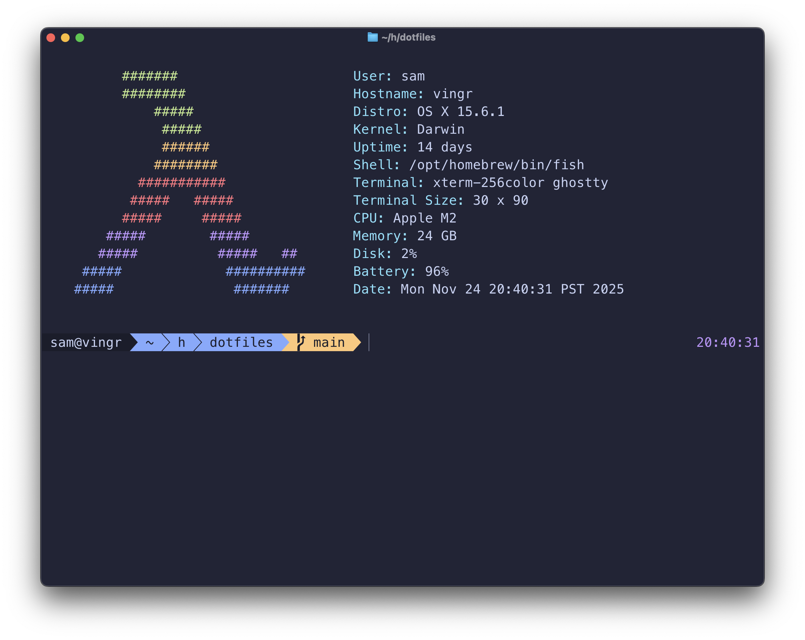

# @codeviking's dotfiles

This repository captures what's required to configure my development environment.

## Prerequisites

Before getting started, install [brew](https://brew.sh).

## Usage

To setup a new environment:

```bash
git clone git@github.com:codeviking/dotfiles.git

# Install required packages
./install.sh

# Add fish as a shell candidate by appending it to /etc/shells
sudo echo "$(brew --prefix)/bin/fish" >> /etc/shells

# Change the default shell to fish.
chsh -s "$(brew --prefix)/bin/fish"
```

Once that's complete launch a new terminal and run:

```bash
# Fish specific installation steps
./install.fish

# Link configuration files into expected locations.
./link.sh

# Configure git
./gitconf.sh
```

You should now see something like this whenever you start a new terminal:



## Advanced

### Commit Signing

To use signed commits, follow [these instructions](https://docs.github.com/en/authentication/managing-commit-signature-verification/generating-a-new-gpg-key) for generating a new key and adding it to GitHub.
After those steps are complete, run:

```bash
# Initialize gpg-agent
./gpg.sh
```

Finally follow [these steps](https://docs.github.com/en/authentication/managing-commit-signature-verification/telling-git-about-your-signing-key)
to configure `git` to sign commits using the key you created.

### Host Specific PATH Extensions

To set host specific `$PATH` extensions create a file named `$HOME/.config/paths.fish`
with contents like:

```fish
#!/opt/homebrea/bin/fish

# gcloud
source "$HOME/lib/google-cloud-sdk/paths.fish.inc"

fish_add_path "$PATH:$HOME/bin"
```
