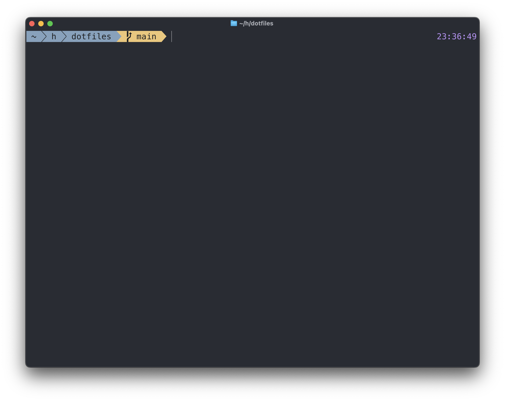

# @codeviking's dotfiles

This repository captures what's required to configure my development
environment.

## Prerequisites

Before getting started, install [brew](https://brew.sh).

## Usage

To setup a new environment:

```bash
git clone git@github.com:codeviking/dotfiles.git

# Install minimum dependencies.
./bootstrap.sh

# Install common packages.
./install.sh

# Add fish as a shell candidate by editing `/etc/shells`:
sudo echo "$(brew --prefix)/bin/fish" >> /etc/shells

# Change the default shell to fish.
chsh -s "$(brew --prefix)/bin/fish"
```

Once that's complete launch a new terminal. Run `link.sh` to finalize things:

```bash
# Link configuration files into expected locations.
./link.sh
```

You should now see something like this whenever you start a new terminal:



There's one more step to get things running. Launch `nvim` and dismiss the
error about a missing theme. Then run `:PackerSync` to install the configured
list of `nvim` plugins (which includes the theme).

That's it. You're all set!

## Advanced

### Commit Signing

I use `gpg` to sign commits. This repository includes scripts for setting that up.

First, follow [these instructions](https://docs.github.com/en/authentication/managing-commit-signature-verification/generating-a-new-gpg-key)
for generating a new GPG key. Then follow the instructions for adding it to
GitHub.

Then initialize things locally by running:

```bash
./gpg.sh
```
And finally follow [these steps](https://docs.github.com/en/authentication/managing-commit-signature-verification/telling-git-about-your-signing-key)
for telling git about your signing key.

### Host Specific PATH Extensions

As much as we'd like to avoid it, host-specific `$PATH` extensions are at 
times warranted.

To set host specific `$PATH` extensions create a file at the path
`$HOME/.config/paths.fish` that looks something like this:

```fish
#!/bin/fish

# gcloud
source "$HOME/lib/google-cloud-sdk/paths.fish.inc"

fish_add_path "$PATH:$HOME/bin"
```

The commands above are examples, populate the file with the `$PATH` specific 
changes that make sense for the host you're on.

