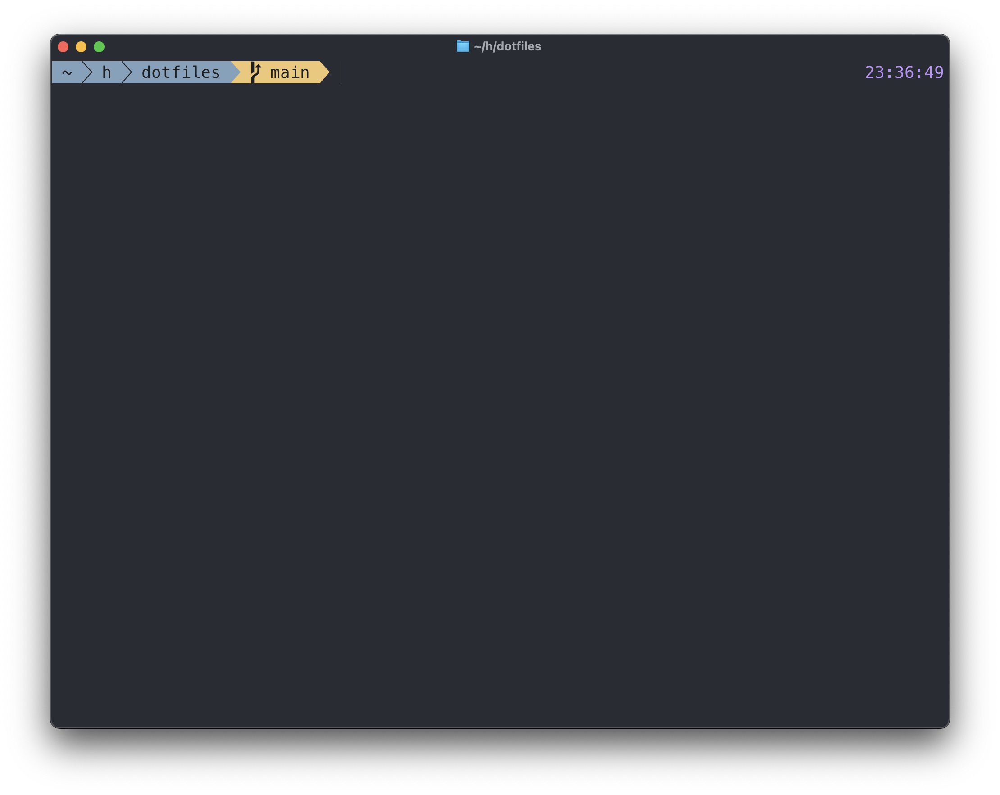

# @codeviking's dotfiles

This repository captures what's required to configure my development environment.

## Prerequisites

Before getting started, install [brew](https://brew.sh) (Homebrew on macOS, Linuxbrew on Linux).

## Usage

To setup a new environment:

```bash
git clone git@github.com:codeviking/dotfiles.git
cd dotfiles
./install.sh
```

The `install.sh` script bootstraps fish, then hands off to `install.fish` which runs the rest of the pipeline. It's safe to re-run.

After install, interactive bash sessions will drop into fish automatically. If you'd rather make fish the actual login shell (and you have sudo), run:

```bash
./shell.sh
```

This adds fish to `/etc/shells` and runs `chsh`. Skip it in environments where you don't own the workspace template.

You should now see something like this whenever you start a new terminal:



## Advanced

### Commit Signing

To use signed commits, follow [these instructions](https://docs.github.com/en/authentication/managing-commit-signature-verification/generating-a-new-gpg-key) for generating a new key and adding it to GitHub.
After those steps are complete, run:

```bash
# Initialize gpg-agent
./gpg.sh
```

Finally follow [these steps](https://docs.github.com/en/authentication/managing-commit-signature-verification/telling-git-about-your-signing-key)
to configure `git` to sign commits using the key you created.
